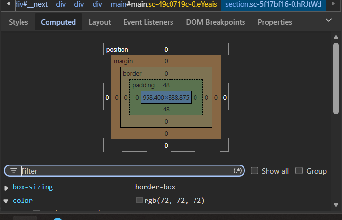

# Reporte Técnico: Auditoría Visual y Modelo de Caja (Pokédex)

Este repositorio contiene la auditoría y corrección de la tarjeta de información para la Pokédex digital de la comunidad "El Último Checkpoint".

## 1. Estructura del Proyecto
* `index.html`: Estructura HTML base de la criatura (Pikachu).
* `style.css`: Estilos CSS completamente corregidos y optimizados.
* `README.md`: Este reporte técnico detallado.

---

## 2. Inspección en el Mundo Real

### Valores identificados en producción:
* **Elemento inspeccionado:** [Tarjeta de producto en Nintendo / Artículo de blog]
* **Margin (Exterior):** [16px]
* **Padding (Interior):** [24px]

---

## 3. Auditoría Manual y Corrección de Errores
Durante la revisión del código entregado por el practicante, se detectaron múltiples fallas críticas. Los **3 errores de sintaxis exactos** corregidos fueron:

1. **Estructura incorrecta de selectores (Llaves cerradas prematuramente):** El practicante colocó `}` justo después del nombre del selector (ej. `body`), dejando las propiedades CSS flotando afuera de las reglas, lo que causaba que el navegador ignorara por completo los estilos.
2. **Falta de unidades de medida:** En la propiedad `width: 300;` del contenedor `.tarjeta-pokemon`, se omitió la unidad de medida (`px`). En CSS, los valores numéricos de dimensión que no sean `0` requieren estrictamente una unidad para ser renderizados.
3. **Valor de propiedad inválido (Idioma incorrecto):** En la clase `.tipo`, se utilizó `text-align: centro;`. La palabra `centro` en español no es un valor válido para CSS; se corrigió al estándar técnico en inglés `center`.

*(Bonus: También se solventó la falta de puntos y comas `;` al final de las propiedades `font-family` y `border-style`).*

---

## 4. Investigación Técnica: Familias Tipográficas
Según la documentación oficial de MDN Web Docs:

* **Diferencia visual:** Las fuentes **Serif** tienen pequeños remates, adornos o "patitas" en los extremos de sus letras (como *Times New Roman*). Las fuentes **Sans-serif** (sin serifas) son tipografías de líneas completamente rectas, limpias y uniformes (como *Arial* o *Helvetica*).
* **Recomendación para pantallas digitales:** Para la lectura en dispositivos y pantallas digitales, se recomienda **Sans-serif**. Al no tener remates decorativos, las letras se distorsionan menos con las rejillas de píxeles, reduciendo notablemente la fatiga visual del usuario y mejorando la legibilidad en resoluciones bajas o pantallas pequeñas.

---

## 5. Reto del Modelo de Caja
* **Propiedad exacta a agregar:** Para solucionar el problema de legibilidad donde el texto chocaba con los bordes, la propiedad que debía añadirse es **`padding`** (espaciado interno). 
* **Justificación:** El `margin` genera un espacio hacia el *exterior* de la caja (alejando la tarjeta de otros elementos del cuerpo de la página), mientras que el `padding` empuja el contenido hacia el *interior*, creando un respiro crucial entre el texto y el borde negro de la tarjeta.

---

## 6. Conclusión
Es de vital importancia mantener una separación estricta entre el **contenido (HTML)** y la **presentación (CSS)** mediante el uso de archivos externos por las siguientes razones de arquitectura web:

* **Mantenibilidad y Escalabilidad:** Si el portal "El Último Checkpoint" decide cambiar el color principal de sus tarjetas en el futuro, solo se deberá modificar una línea en el archivo `style.css`, en lugar de buscar y editar manualmente el estilo de cientos de archivos HTML de pokémones individuales.
* **Reutilización de Código:** Un único archivo CSS puede dar estilo a toda la Pokédex de la comunidad de manera uniforme.
* **Rendimiento de Carga:** El navegador descarga el archivo `.css` externo una sola vez y lo guarda en su memoria caché, haciendo que la navegación entre distintas páginas del sitio sea mucho más rápida y eficiente para el usuario.